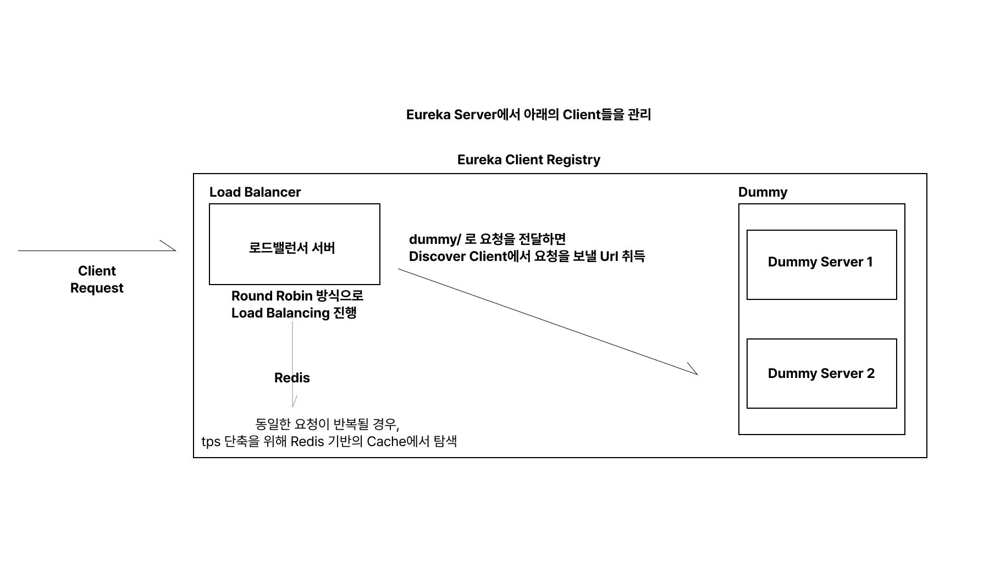

# Load Balancer Boilerplate
해당 어플리케이션은 LoadBalancer와 내부의 Dummy Server를 구축한 Boilerplate 프로젝트입니다.

## 사용한 Infra
- `resilience4j` for Circuit Breaker
- `redis` for Cache
- `spring cloud` for Load Balancing
- `WebClient` for Api Calling

## 사용 방법 

git clone을 받은 뒤 루트 폴더에서 다음 명령어를 입력해주세요.
```shell
./gradlew build

docker network create load-balancer-network

docker-compose up --build
```
해당 프로젝트는 여러 어플리케이션이 Docker 환경으로 구성되어 있습니다. 
따라서, 루트 프로젝트에서 jar 파일을 생성할 수 있게 빌드를 진행한 뒤 Docker 네트워크를 먼저 구축하여야 합니다.

## 구조
서비스 구조는 아래와 같습니다.


요청을 전달할 서버가 추가되고, 제거되는 상황을 대비하기 위해 Eureka Server를 구성하였습니다. 

각각 아래의 포트에서 실행되고 있습니다.
- LoadBalancer : 8080
- dummy server : 8081, 8082
- eureka server : 8761 

## 요청 흐름
1. Client에게 (`{service_url}/test/{id}`로) 요청이 들어옴
2. 로드밸런서 서버가 이를 받아 1차적으로 CACHE에 해당 요청에 해당하는 값이 있는지 찾음
3. 없다면 DummyServer로 요청을 넘김 (이 때, 스레드 점유로 인한 서버 마비를 막기 위해 요청을 받아오는 time out을 5초로 설정)
4. 요청을 받아온 로드밸런서 서버가 캐시에 해당 정보를 저장하고, 클라이언트에게 응답을 반환

## 주의 사항
해당 어플리케이션은 요청을 넘겨주는 메인 서버의 fall back이 로드밸런서 서버에 영향을 주지 않도록 Circuit Breaker 환경을 갖추고 있습니다.
따라서 요청이 임계치를 넘어 실패하는 경우 5초 동안 해당 API를 사용할 수 없습니다.